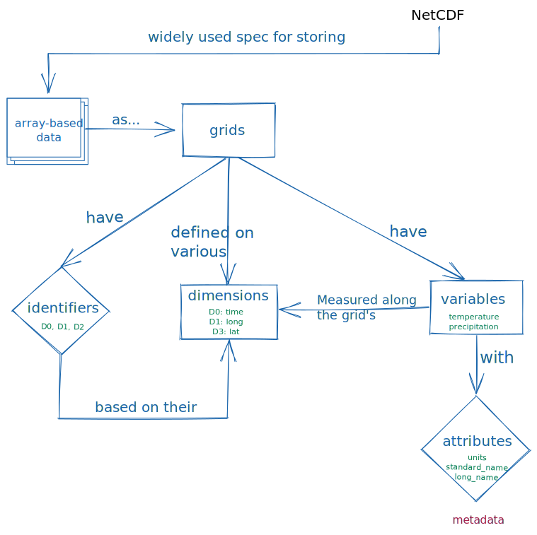

# concept_maps
Repo to store concept maps for institutional knowledge and re-use in trainings

## NETCDF data format
You can find a good introduction to NetCDF data [here](https://ropensci.org/blog/2019/11/05/tidync/)

